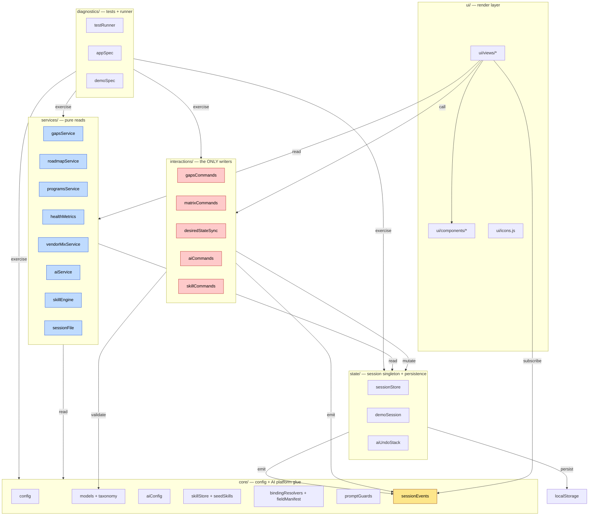

# C4-3 · Components

**Audience**: contributors making changes inside any layer.
**Purpose**: show the modules inside each browser-side layer and how they communicate. Six layers shown: `core/`, `state/`, `services/`, `interactions/`, `ui/`, `diagnostics/`.

The strict layering rule (SPEC §1 invariant 6, RULES.md §1): **only `interactions/*` mutates session state. Services are pure reads. Views call commands and services — never mutate directly.**

---

## Layer interaction overview

---

## `core/` — config + AI platform glue

Pure modules. No mutation, no DOM. Imported by every layer above.

| Module | Purpose | Key exports |
|---|---|---|
| [config.js](../../../core/config.js) | Static catalog: layers, environments, business drivers, customer verticals, technology catalog | `LAYERS`, `ENVIRONMENTS`, `BUSINESS_DRIVERS`, `CUSTOMER_VERTICALS`, `CATALOG`, `LEGACY_DRIVER_LABEL_TO_ID` |
| [models.js](../../../core/models.js) | Validators for instance + gap shapes | `validateInstance`, `validateGap`, `LayerIds`, `EnvironmentIds` |
| [taxonomy.js](../../../core/taxonomy.js) | 7-term Action table (Phase 17) + link-rule helpers | `ACTIONS`, `GAP_TYPES`, `validateActionLinks`, `requiresAtLeastOneCurrent`, `requiresAtLeastOneDesired`, `actionById` |
| [aiConfig.js](../../../core/aiConfig.js) | Provider config (localStorage `ai_config_v1`) | `loadAiConfig`, `saveAiConfig`, `PROVIDERS`, `DEFAULT_AI_CONFIG`, `isActiveProviderReady` |
| [skillStore.js](../../../core/skillStore.js) | User-defined AI skills CRUD (localStorage `ai_skills_v1`) | `loadSkills`, `saveSkills`, `addSkill`, `updateSkill`, `deleteSkill`, `skillsForTab`, `getSkill`, `normalizeSkill` |
| [seedSkills.js](../../../core/seedSkills.js) | 6 built-in skills auto-deployed on first run | `seedSkills()` |
| [fieldManifest.js](../../../core/fieldManifest.js) | Per-tab catalog of bindable fields (writable: true gates AI writes) | `FIELD_MANIFEST`, `buildPreviewScope` |
| [bindingResolvers.js](../../../core/bindingResolvers.js) | 13 `WRITE_RESOLVERS` for `context.*` AI writes | `WRITE_RESOLVERS`, `isWritablePath` |
| [promptGuards.js](../../../core/promptGuards.js) | Non-removable system-prompt footers per `responseFormat` | `getSystemFooter` |
| [sessionEvents.js](../../../core/sessionEvents.js) | Pub/sub bus for session-changed events | `onSessionChanged`, `emitSessionChanged` |
| [helpContent.js](../../../core/helpContent.js) | Help-modal prose | `HELP_CONTENT` |
| [version.js](../../../core/version.js) | App version string | `VERSION` |

## `state/` — session singleton + persistence

The only place that holds mutable session state. Three modules:

- [sessionStore.js](../../../state/sessionStore.js) — exports the live `session` object + `migrateLegacySession`, `createEmptySession`, `resetSession`, `resetToDemo`, `replaceSession`, `loadFromLocalStorage`, `saveToLocalStorage`, `isFreshSession`. Persistence under `dell_discovery_v1`.
- [demoSession.js](../../../state/demoSession.js) — `createDemoSession` + `DEMO_PERSONAS` (Acme FSI, Meridian HLS, Northwind Public Sector). Exercises every shipped feature.
- [aiUndoStack.js](../../../state/aiUndoStack.js) — `push`, `undoLast`, `undoAll`, `canUndo`, `peekLabel`, `depth`, `recentLabels`, `clear`, `onUndoChange`. Persisted under `ai_undo_v1` (cap 10).

## `services/` — pure read-only views

No mutation, no events. Take session + config, return derived data.

- [gapsService.js](../../../services/gapsService.js) — gap filtering helpers.
- [roadmapService.js](../../../services/roadmapService.js) — `buildProjects`, `Coverage`, `Risk`, `Session Brief`. The crown-jewel surface.
- [programsService.js](../../../services/programsService.js) — `suggestDriverId`, `effectiveDriverId`, `effectiveDellSolutions`. Driver-suggestion ladder (D1-D10).
- [healthMetrics.js](../../../services/healthMetrics.js) — heatmap scoring per (layer, environment).
- [vendorMixService.js](../../../services/vendorMixService.js) — Dell vs non-Dell vendor aggregation.
- [aiService.js](../../../services/aiService.js) — `chatCompletion` with retry-with-backoff + per-provider fallback chain.
- [skillEngine.js](../../../services/skillEngine.js) — `runSkill`, `renderTemplate`, `extractBindings`, `coerceForLLM`.
- [sessionFile.js](../../../services/sessionFile.js) — `.canvas` envelope build + apply (v2.4.10).

## `interactions/` — the writer layer

Every module here is a **command** module: takes the session, mutates it, returns nothing or the new shape. Validates before save. Emits `session-changed` after.

- [gapsCommands.js](../../../interactions/gapsCommands.js) — `createGap`, `updateGap`, `deleteGap`, `approveGap`, `linkCurrentInstance`, `linkDesiredInstance`, `unlinkCurrentInstance`, `unlinkDesiredInstance`, `setGapDriverId`, `setPrimaryLayer`, `deriveProjectId`. **Only place that mutates `session.gaps`.**
- [matrixCommands.js](../../../interactions/matrixCommands.js) — `addInstance`, `updateInstance`, `deleteInstance`, `moveInstance`, `mapAsset`, `unmapAsset`, `proposeCriticalityUpgrades`. **Only place that mutates `session.instances`.**
- [desiredStateSync.js](../../../interactions/desiredStateSync.js) — `buildGapFromDisposition`, `syncGapFromDesired`, `syncDesiredFromGap`, `syncGapsFromCurrentCriticality`, `confirmPhaseOnLink`. Cascade logic between desired-state tiles and their auto-drafted gaps.
- [aiCommands.js](../../../interactions/aiCommands.js) — `parseProposals`, `applyProposal`, `applyAllProposals`. AI-write entry point. Pushes undo snapshot before mutation.
- [skillCommands.js](../../../interactions/skillCommands.js) — `runSkillById`, `skillsForTab`. Thin adapter into the skill engine.

**Architectural caveat (R-INT-2 from `.d01`)**: `customer.drivers` is currently mutated *directly* by [ContextView.js:130](../../../ui/views/ContextView.js) via `splice()`, violating the "only `interactions/*` mutates" rule. Tracked as a v2.5.x cleanup; see [adr/ADR-009](../../adr/ADR-009-relationship-cascade-policy.md).

## `ui/` — render layer

Subscribes to `session-changed`. Calls `interactions/*` commands and reads from `services/*`. Never mutates directly.

- [`ui/views/`](../../../ui/views/) — 12 view modules, one per Tab/sub-tab.
- [`ui/components/`](../../../ui/components/) — 2 reusable components: `UseAiButton` (per-tab AI dropdown), `PillEditor` (contenteditable binding-pill editor for the skill admin).
- [`ui/icons.js`](../../../ui/icons.js) — inline-SVG helpers.

## `diagnostics/` — tests + runner

Always shipped (tests-as-contract per [adr/ADR-001](../../adr/ADR-001-vanilla-js-no-build.md)).

- [testRunner.js](../../../diagnostics/testRunner.js) — minimal in-browser test framework + `runIsolated` localStorage snapshot/restore guard.
- [appSpec.js](../../../diagnostics/appSpec.js) — 487 assertions across suites 01-42.
- [demoSpec.js](../../../diagnostics/demoSpec.js) — 22 assertions (DS1-DS22) pinning the human-test surface (demo + seed-skills) to the live data model.

---

## Read this before changing a layer

| If you're touching… | Read first |
|---|---|
| A new field on instance / gap / driver | [feedback_foundational_testing.md](../../../../../.claude/projects/C--Users-Mahmo-OneDrive-Documents-Claud-AI-PreSales-App/memory/feedback_foundational_testing.md) — two-surface rule (demo + seed + demoSpec + DEMO_CHANGELOG must update in the same commit) |
| `interactions/*` to add a write path | [adr/ADR-005](../../adr/ADR-005-writable-path-resolver-protocol.md) — writable-path resolver protocol |
| `services/*` adding cascading logic | Reconsider — that belongs in `interactions/*`. The pure-reads invariant matters. |
| `ui/views/*` rendering a relationship | Confirm the relationship is surfaced via `services/*`, not derived inline in the view |
| The validators in `core/models.js` | [docs/RULES.md](../../../docs/RULES.md) — the rules-as-built audit |

See [adr/ADR-006](../../adr/ADR-006-session-changed-event-bus.md) for why the event bus exists, and [adr/ADR-008](../../adr/ADR-008-undo-stack-hybrid.md) for the undo-stack design.
