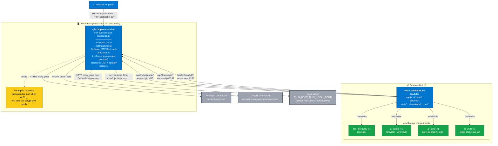

# C4-2 · Container

**Audience**: contributors, operators.
**Purpose**: show the runtime architecture inside the Dell Discovery Canvas system boundary — the nginx container, the SPA modules in the browser, the localStorage compartments, and the proxy paths to upstream LLMs.

---

## Diagram

---

## The browser-side SPA

Single-page application served from `index.html`. Module graph rooted at [`app.js`](../../../app.js):

- **`core/`** — pure config + types + AI platform glue (`taxonomy`, `models`, `aiConfig`, `skillStore`, `bindingResolvers`, `fieldManifest`, `promptGuards`, `seedSkills`, `sessionEvents`, `version`). 12 modules, ~1.8K LOC.
- **`state/`** — single mutable session + the persistence layer (`sessionStore`, `demoSession`, `aiUndoStack`). 3 modules, ~740 LOC.
- **`services/`** — pure read-only views of state (`gapsService`, `roadmapService`, `programsService`, `healthMetrics`, `vendorMixService`, `aiService`, `skillEngine`, `sessionFile`). 8 modules, ~1.5K LOC.
- **`interactions/`** — the **only** modules permitted to mutate session state (`gapsCommands`, `matrixCommands`, `desiredStateSync`, `aiCommands`, `skillCommands`). 5 modules, ~800 LOC.
- **`ui/views/`** + **`ui/components/`** — render functions. Subscribe to `session-changed` event bus; never mutate directly. 12 views + 2 components + 1 icon module, ~4.7K LOC.
- **`diagnostics/`** — in-browser test runner + 509 assertions. Runs 150ms after page-load. Not part of the production surface but always shipped (tests-as-contract).

## The nginx container

Static-file image based on `nginx:1.27-alpine`. ~75MB compressed. Multi-arch tagged (`linux/amd64` + `linux/arm64`).

**Responsibilities**:

1. **Static-file delivery** — served from `/usr/share/nginx/html/`. Explicit COPY whitelist in [Dockerfile](../../../Dockerfile) (no `.gitignore` defense in depth needed; Docker copies only what we explicitly list).
2. **Optional HTTP Basic auth** — when `AUTH_USERNAME` + `AUTH_PASSWORD` env vars are both set at container start, [40-setup-auth.sh](../../../docker-entrypoint.d/40-setup-auth.sh) generates a bcrypt-style htpasswd file. `/health` is always reachable without auth so HEALTHCHECK / external monitors don't need credentials.
3. **LLM reverse proxy** — [45-setup-llm-proxy.sh](../../../docker-entrypoint.d/45-setup-llm-proxy.sh) writes three `location` blocks at container start:
   - `/api/llm/local/*` → `http://${LLM_HOST}:${LLM_LOCAL_PORT}/`
   - `/api/llm/anthropic/*` → `https://api.anthropic.com/`
   - `/api/llm/gemini/*` → `https://generativelanguage.googleapis.com/`
   All three have `access_log off` per [SPEC §12.8 invariant 5](../../../SPEC.md). User-supplied API keys flow through via `proxy_pass_request_headers on`.
4. **Security headers** — server-scoped `add_header always` directives: comprehensive CSP (`default-src 'self'`, `frame-ancestors 'none'`), `X-Content-Type-Options nosniff`, `X-Frame-Options DENY`, `Referrer-Policy no-referrer`, `Permissions-Policy camera=(), microphone=(), geolocation=()`.
5. **Cache-busting** — `expires -1` on `/index.html` and on `*.js|*.mjs|*.css` so the SPA never silently runs stale modules against a freshly-updated index. ETag handles efficient conditional requests.

## The localStorage compartments

| Key | Owner | Shape pointer | Migration | Lifecycle |
|---|---|---|---|---|
| `dell_discovery_v1` | [state/sessionStore.js](../../../state/sessionStore.js) | [SPEC §2](../../../SPEC.md) — Session shape | `migrateLegacySession` runs on every load (idempotent) | Cleared by the footer "Clear all data" button or DevTools |
| `ai_config_v1` | [core/aiConfig.js](../../../core/aiConfig.js) | `{activeProvider, providers: {local, anthropic, gemini}}` | `mergeWithDefaults` preserves user keys + applies one-shot model deprecation migrations | Survives session resets |
| `ai_skills_v1` | [core/skillStore.js](../../../core/skillStore.js) | `Skill[]` per [SPEC §12.1](../../../SPEC.md) | `normalizeSkill` on load (preserves unknown fields, migrates legacy `outputMode` → `applyPolicy`) | Survives session resets |
| `ai_undo_v1` | [state/aiUndoStack.js](../../../state/aiUndoStack.js) | `{label, snapshot, timestamp}[]`, cap 10 | Type-checks each entry, trims to MAX_DEPTH on load | Cleared by `resetSession` / `resetToDemo` |

See [adr/ADR-002](../../adr/ADR-002-localstorage-only-persistence.md) for the rationale.

## Deploy modes

- **Localhost-only (default)** — `BIND_ADDR` defaults to `127.0.0.1`. Container only reachable from the host. No auth required. Safe for personal dev.
- **LAN-exposed** — set `BIND_ADDR=0.0.0.0` + `AUTH_USERNAME`/`AUTH_PASSWORD`. Container reachable from any host on the LAN; HTTP Basic auth gates access. Suitable for team-shared workstation.

## When this diagram changes

- A new localStorage key is added → new node in the storage compartment.
- A new AI provider → new proxy `location` block + new external upstream.
- v3 backend ships → SPA gains "API client" arrow to a new server-side container; localStorage compartments shrink to client-cache only.
- File-based session storage (already shipped in v2.4.10 via `.canvas` File System Access API) is not depicted here — it's a user-driven import/export, not part of runtime data flow.
