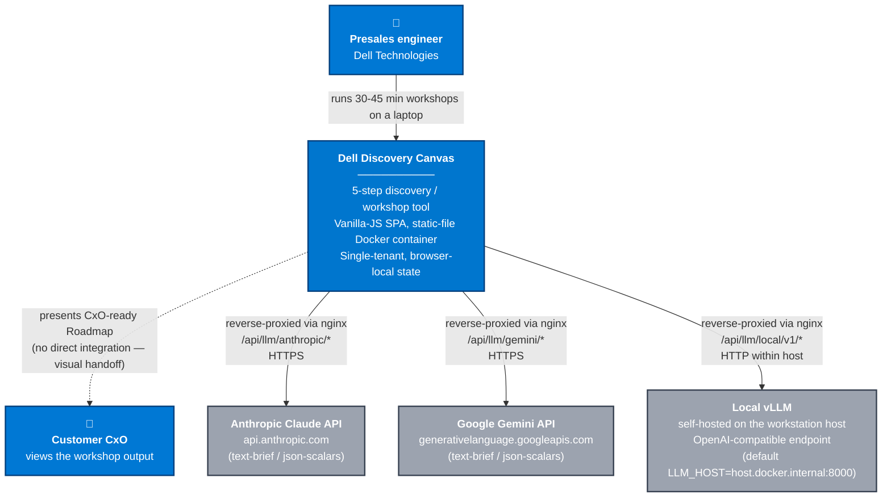

# C4-1 · System Context

**Audience**: stakeholders, new contributors, operators.
**Purpose**: show Dell Discovery Canvas in its environment — who uses it, what it talks to, and why.

---

## Diagram

---

## Roles + boundaries

**Presales engineer** — primary user. Runs 30-45 minute customer-discovery workshops. Edits the canvas live with the customer; reviews the auto-generated Roadmap with them. Brings a workstation (the container host) and a laptop browser.

**Customer CxO** — secondary observer. Sees the Roadmap at the end of the session; doesn't directly interact with the app. Roadmap is presented as a screen-share or exported `.canvas` workbook file.

**Dell Discovery Canvas** — the system in scope. Single-page application served as static files from an `nginx:alpine` container running on the presales engineer's workstation (or any reachable Docker host). All session state lives in browser localStorage; the container holds no per-user data.

## External dependencies

| Service | Purpose | Authentication | Data flow |
|---|---|---|---|
| **Anthropic Claude API** | AI skill execution (text + JSON) | User-supplied API key in browser localStorage; passed via `x-api-key` header through the nginx proxy | Outbound only. Prompt + skill output. No PII leaves except what the user typed into the session. |
| **Google Gemini API** | AI skill execution (text + JSON) | User-supplied API key; passed via `?key=` query through the nginx proxy | Same as Anthropic. |
| **Local vLLM** | AI skill execution (offline, OpenAI-compatible) | None (typical self-hosted vLLM is unauth'd behind the proxy) | Same-host HTTP only. |

## Data sovereignty

- All user-authored session content lives in browser `localStorage` (key `dell_discovery_v1`). Never transmitted to any service except as part of an explicit AI-skill prompt.
- API keys live in `localStorage[ai_config_v1]`, visible to anyone with DevTools access on the same browser profile. v3 multi-user platform moves keys server-side.
- No telemetry. The nginx LLM-proxy locations have `access_log off` per SPEC §12.8 invariant 5; no request payloads are persisted server-side.

## Scope boundaries (what's outside this system)

- Customer's existing IT estate — captured as session input, not integrated.
- Dell's product catalog — captured as a static file (`core/config.js CATALOG`), not pulled from a live API.
- CRM / CPQ / quoting — out of scope; downstream concerns.
- Multi-user collaboration, real-time sync — v3 concern.

## When this diagram changes

- A new AI provider is added → new external service node + new proxy path.
- v3 multi-user platform ships → server backend appears as a new boundary; `localStorage` shifts from "system of record" to "client-side cache".
- Customer-side CRM integration ships → new external system + outbound data flow.

See [adr/ADR-002](../../adr/ADR-002-localstorage-only-persistence.md) for the rationale behind today's offline-first single-tenant model.
