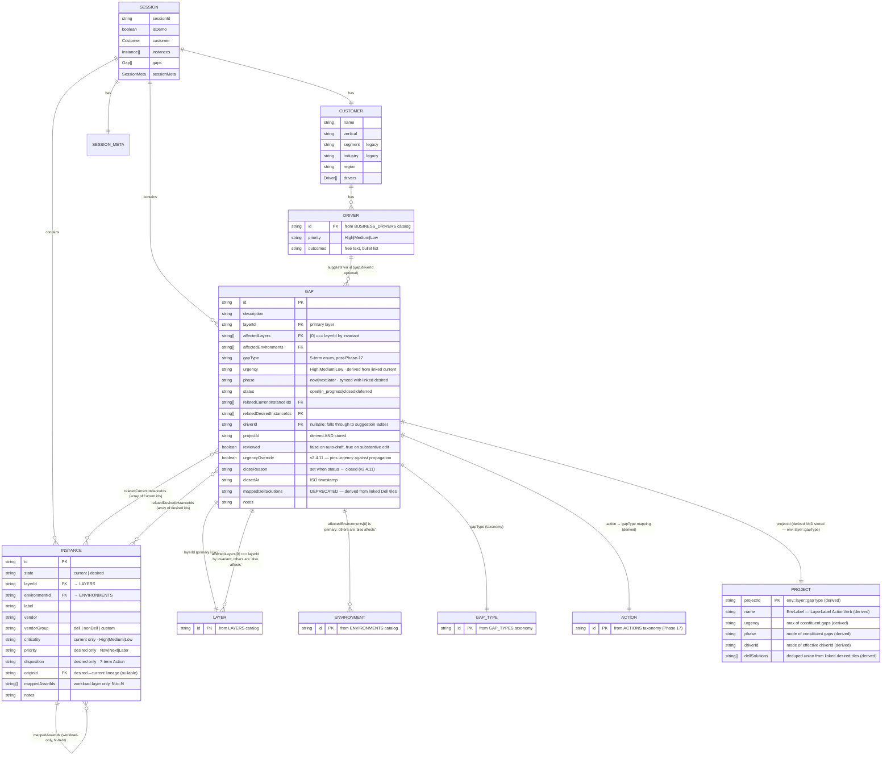

# Data Model · Entity-Relationship Diagram

**Audience**: anyone touching the session shape, the validators, or any cross-entity logic.
**Purpose**: show the live entity model, every FK-style relationship, the cardinality of each link, and which fields are derived vs. stored.

This is the **load-bearing diagram** for the open CMDB-vs-UX evaluation. The relationship-integrity audit in [docs/MAINTENANCE_LOG.md · v2.4.11.d01](../../../docs/MAINTENANCE_LOG.md) feeds directly into this picture.

---

## Diagram

---

## Cardinality summary

| Relationship | Cardinality | Direction | Stored on | Derived? | Validated? |
|---|---|---|---|---|---|
| `Session` 1—1 `Customer` | mandatory | session owns customer | `session.customer` | no | shape check only |
| `Customer` 1—N `Driver` | optional (can be empty) | customer owns drivers array | `customer.drivers[]` | no | each entry has `id` ∈ BUSINESS_DRIVERS |
| `Driver` 1—N `Gap` (via `driverId`) | optional | gap points back to driver id | `gap.driverId` | partial — falls through to `programsService.suggestDriverId` ladder D1-D10 if null | no integrity check; dead-pointer tolerated |
| `Session` 1—N `Instance` | optional | session owns instances array | `session.instances[]` | no | `validateInstance` per entry |
| `Session` 1—N `Gap` | optional | session owns gaps array | `session.gaps[]` | no | `validateGap` per entry |
| `Instance` 1—1 `Instance` (via `originId`) | optional, desired→current | desired tile points to source current | `instance.originId` | no | no integrity check; dead-pointer tolerated for visual carry-through |
| `Instance` (workload) M—N `Instance` (asset) (via `mappedAssetIds`) | optional, workload-layer only | workload owns the array | `instance.mappedAssetIds[]` | no | `validateInstance` enforces array-of-strings + workload-layer-only (W1b/I9); link integrity NOT enforced |
| `Gap` M—N `Instance` (via `relatedCurrentInstanceIds`) | optional | gap owns the array | `gap.relatedCurrentInstanceIds[]` | no | soft only — `validateActionLinks` enforces minimum counts on **reviewed** gaps; link integrity NOT enforced |
| `Gap` M—N `Instance` (via `relatedDesiredInstanceIds`) | optional | gap owns the array | `gap.relatedDesiredInstanceIds[]` | no | same as above |
| `Gap` 1—1 `Layer` (via `layerId`) | mandatory | gap declares its primary layer | `gap.layerId` | no | `validateGap` enforces ∈ LAYERS |
| `Gap` 1—N `Layer` (via `affectedLayers`) | optional | gap declares "also affects" | `gap.affectedLayers[]` | partial — `affectedLayers[0] === layerId` invariant | enforced by `validateGap` (G6, v2.4.9) |
| `Gap` 1—N `Environment` (via `affectedEnvironments`) | optional | gap declares "also affects" | `gap.affectedEnvironments[]` | no — `[0]` is "primary" by convention | each entry ∈ ENVIRONMENTS |
| `Gap` 1—1 `Project` (via `projectId`) | mandatory after migration | gap stores derived id | `gap.projectId` | yes — `deriveProjectId(gap)` = `env::layer::gapType` | not validated; recomputed on structural patches |
| `Gap` 1—1 `GapType` | optional but typically set | gap stores enum | `gap.gapType` | no | `validateGap` enforces ∈ GAP_TYPES |

## Derivation chains (read-only at render time)

These projections are computed on demand; no storage:

| Projection | Computed from | Where |
|---|---|---|
| **Project** (entity) | `gap.projectId` grouping; aggregates `urgency` (max), `phase` (mode), `driverId` (mode), `dellSolutions` (deduped union) | [`services/roadmapService.js buildProjects`](../../../services/roadmapService.js) |
| **Effective driver** (per gap) | `gap.driverId ?? programsService.suggestDriverId(gap)` (D1-D10 ladder) | [`services/programsService.js effectiveDriverId`](../../../services/programsService.js) |
| **Effective Dell solutions** (per gap or project) | walk linked desired tiles → filter `vendorGroup === "dell"` → unique labels | [`services/programsService.js effectiveDellSolutions`](../../../services/programsService.js) |
| **Health / risk scores** | per-(layer, environment) sum of criticality/urgency weights | [`services/healthMetrics.js`](../../../services/healthMetrics.js) |
| **Vendor mix** | `session.instances.filter(state=current).group(vendorGroup)` | [`services/vendorMixService.js`](../../../services/vendorMixService.js) |

## Integrity zones (the cascade boundaries)

Three known integrity findings from the `v2.4.11.d01` audit, captured here so the picture is complete. See [adr/ADR-009](../../adr/ADR-009-relationship-cascade-policy.md) for the policy.

1. **`deleteInstance` does NOT cascade-clean** `gap.relatedCurrentInstanceIds`, `gap.relatedDesiredInstanceIds`, or other workloads' `mappedAssetIds`. Renderers tolerate dangling IDs; data accumulates orphans.
2. **`customer.drivers.splice()` happens directly in `ContextView.js:130`** — bypasses the `interactions/*` writer rule. Plus driver-delete doesn't cascade to `gap.driverId` (R-INT-3).
3. **`instance.originId`** is never cleared — desired-tile lineage to a source current that may have been deleted. Same orphan-tolerance pattern.

All three are **intentional UX trade-offs** (see [`core/models.js:96-98`](../../../core/models.js)) — orphan tolerance keeps the workshop save flow unblocked. Cleanup queued for v2.5.x per ADR-009.

## When this diagram changes

- A new field added to gap or instance → update the entity column + the relationship table if FK-shaped.
- A new entity (e.g., `services[]` for v2.4.12) → add the box + relationship arrows.
- Migrator coercion (e.g., Phase 17 `rationalize` → `ops`) → no diagram change; the value space changes but the entity shape doesn't.
- v3 multi-user: introduces `User`, `Org`, `Tenant` entities; supersedes this diagram.

See [docs/RULES.md](../../../docs/RULES.md) for the live rules-as-built audit, [SPEC §2](../../../SPEC.md) for the canonical entity definitions, and [docs/MAINTENANCE_LOG.md](../../../docs/MAINTENANCE_LOG.md) for the relationship-integrity audit trail.
