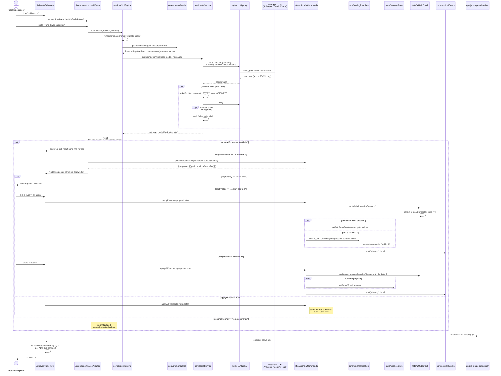

# Flow · AI Skill Execution

**Audience**: contributors touching the AI platform.
**Purpose**: show end-to-end what happens when a presales engineer clicks a skill in the "✨ Use AI ▾" dropdown — from button click to applied write to re-rendered view.

---

## Sequence

---

## Key invariants exercised by this flow

1. **Every apply pushes ONE undo snapshot before mutation.** [SPEC §12.8 invariant 4](../../../SPEC.md). If `aiUndoStack.push` throws (quota exceeded), apply aborts.
2. **Every successful apply emits `session-changed` with reason `"ai-apply"`.** [SPEC §12.8 invariant 6](../../../SPEC.md). DS16/DS17 are the regression gates.
3. **Direct `session.*` mutation is forbidden outside `interactions/aiCommands.js`.** [SPEC §12.8 invariant 3](../../../SPEC.md). `applyProposal` is the funnel.
4. **`outputSchema` is an allowlist** — keys outside the schema are silently dropped at parse time. [SPEC §12.4](../../../SPEC.md).
5. **`writable: true` is the gate** — paths without it are rejected by `applyProposal`. [ADR-005](../../adr/ADR-005-writable-path-resolver-protocol.md).

## Reliability stack

The retry-with-backoff + per-provider fallback chain (v2.4.5.1, [SPEC §12.4a](../../../SPEC.md)):

| Behaviour | Value |
|---|---|
| Retriable HTTP statuses | 429, 500, 502, 503, 504 + network errors |
| Non-retriable | 401, 403, other 4xx |
| Retries per model | 3 (primary + 2 retries) |
| Base backoff | 500ms, doubles, capped at 4000ms |
| Jitter | full-jitter (`random(0, capped)`) |
| Fallback chain | per-provider `fallbackModels[]`; tried after primary exhausts retries |

## Anthropic-specific note

The `anthropic-dangerous-direct-browser-access: true` header is set unconditionally by `services/aiService.js buildRequest("anthropic", ...)`. Without it Anthropic returns 401 with a message naming the header. See [ADR-003](../../adr/ADR-003-nginx-reverse-proxy-llm-cors.md).

## When this flow changes

- New AI provider → new request-shape branch in `aiService.js buildRequest`, new `location` in nginx proxy.
- New `responseFormat` → new `getSystemFooter` branch, new `parseProposals`/`parseCommands` dispatch in `aiCommands.js`.
- New `applyPolicy` → new branch in `useAiButton.js` proposals UI dispatch.
- v2.6.0 `json-commands` runtime: `parseCommands` + `applyCommands` parallel paths to the existing scalar pipeline; same undo + event-bus contract.
