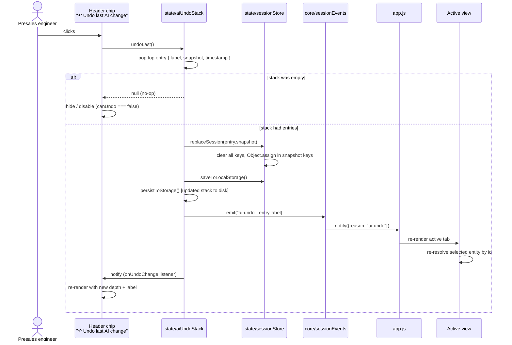
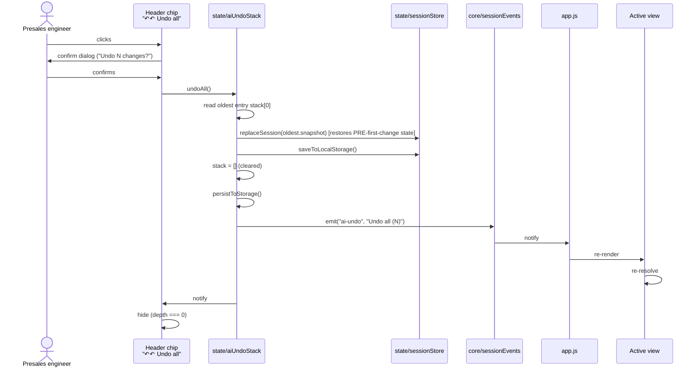

# Flow · Undo (single + bulk)

**Audience**: anyone debugging undo behaviour or extending the apply pipeline.
**Purpose**: show what happens when the user clicks "↶ Undo last AI change" or "↶↶ Undo all" in the header.

---

## Single undo



## Bulk undo (Undo all)



## Reset boundaries

When the user clicks "+ New session" or "↺ Load demo":

```mermaid
sequenceDiagram
    actor user as Presales engineer
    participant footer as Footer button
    participant ss as state/sessionStore
    participant us as state/aiUndoStack
    participant se as core/sessionEvents

    alt "+ New session"
        user->>footer: clicks
        footer->>ss: resetSession()
        ss->>ss: clear session keys, Object.assign(createEmptySession())
        ss->>us: clear() [drops every entry; undo doesn't survive a deliberate "start over"]
        ss->>se: emit("session-reset", "New session")
    else "↺ Load demo"
        user->>footer: clicks
        footer->>ss: resetToDemo()
        ss->>ss: createDemoSession() + migrateLegacySession + assign
        ss->>us: clear()
        ss->>se: emit("session-demo", "Loaded demo session")
    end
```

---

## Storage round-trip

After every `push` / `undoLast` / `undoAll` / `clear`, the stack is persisted to `localStorage[ai_undo_v1]`. On page load:

1. `state/aiUndoStack.js` IIFE calls `loadFromStorage()`.
2. `JSON.parse` the raw value.
3. Type-check: must be an array.
4. Trim to `MAX_DEPTH = 10` entries from the front (drop oldest if over cap — should be idempotent but defensive).
5. Filter out malformed entries (each must have `e && e.snapshot && typeof e.snapshot === "object"`).
6. Assign to in-memory `stack` variable.

If localStorage is unavailable (private mode, quota exceeded), `loadFromStorage` returns `[]` and the stack works in-memory only. See [ADR-008](../../adr/ADR-008-undo-stack-hybrid.md).

## Failure modes (defensive)

- **`replaceSession` throws** (extremely unlikely; would indicate corrupted snapshot): caught in `undoLast` / `undoAll`, logged via `console.error`, notify still fires so the chip re-renders. Better to leave a trace than silently no-op.
- **`saveToLocalStorage` throws** (quota exceeded): caught, returns false. The undo IS applied in-memory; the next page reload would re-hydrate from the pre-undo persisted state — temporary inconsistency. Acceptable; the user can retry.
- **`persistToStorage` throws** (same): caught silently. Stack works in-memory until reload.

## Test coverage

- **Suite 33 DS13/DS14** — `applyProposal` then `undoLast` produces JSON-byte-identical state.
- **Suite 35 DS16/DS17** — every `applyProposal` emits `"ai-apply"`; every `undoLast` emits `"ai-undo"`.
- **Suite 30 OH1-OH17** — `applyAllProposals` batched undo behaves as one logical entry.
- **Suite 25 AI4** — undo is no-op when stack is empty.

## When this flow changes

- New mutation source → must call `aiUndoStack.push` before mutating, must emit a session-changed reason.
- v2.6.0 action-commands batch → same one-snapshot-per-batch rule as `applyAllProposals`.
- Multi-user (v3) → undo becomes per-user-per-session; localStorage moves to server-side per-user undo log.
