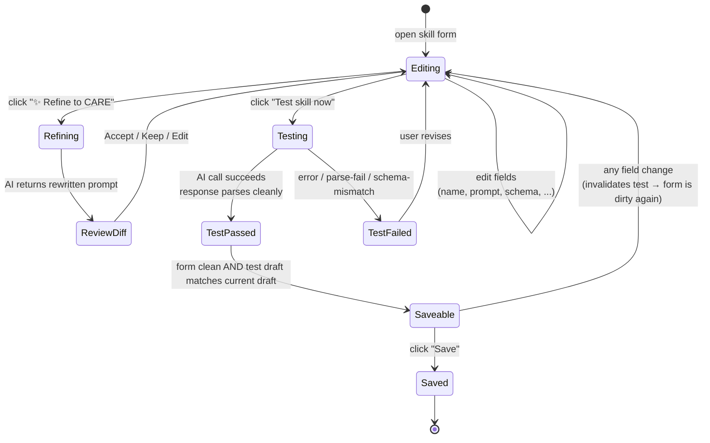

# State Machine · Skill-admin Save Gate

**Audience**: contributors touching the skill builder UI in `ui/views/SkillAdmin.js`.
**Purpose**: show how the "Save" button on the skill editor gates user input through a test-must-pass loop. Codified in v2.4.3 (Phase 19d.1 · prompt guards) to force the iteration loop and prevent users saving broken-prompt skills.

---

## States + transitions

---

## Why the gate exists

Pre-v2.4.3, the user could save a skill that had never successfully called the AI. The save would land; the next time the user clicked the skill from the dropdown, it'd fail at run time with a confusing error. The fix in v2.4.3 (Phase 19d.1) was to **force the iteration loop**: the user MUST run "Test skill now" successfully before "Save" enables. The test snapshots the prompt; if the user edits the prompt after the successful test, the snapshot is invalidated and they must re-test.

Three benefits:

1. **Save = "I have proven this works"** — saved skills are never broken-on-arrival.
2. **The test cycle is the iteration cycle** — users naturally iterate on prompt + schema + test, instead of save-and-pray.
3. **Forces engagement with `responseFormat`** — a skill declared as `json-scalars` whose test returns plain text fails the schema check at test time, surfacing the mismatch before save.

## Save-button states (visible in the UI)

| Internal state | Save button label | Disabled? | Other UI |
|---|---|---|---|
| `Editing` (no test yet) | "Save" | Yes | Tooltip: "Run a successful test before saving" |
| `Testing` | "Save" | Yes | "Test skill now" button shows spinner |
| `TestPassed`, draft unchanged | "Save" | **No** | Green hint: "Test passed · ready to save" |
| `TestFailed` | "Save" | Yes | Inline error from AI / parser; user revises |
| `Saveable` (test passed AND draft unchanged) | "Save" | **No** | — |
| `Saved` | (form closes; returns to skill list) | — | Toast: "Skill saved" |

The `Saveable → Editing` transition fires on **any** form-field change, including editing the prompt by one character. Snapshot mismatch invalidates the test; "Save" disables again with the original tooltip.

## Refine-to-CARE workflow

The "✨ Refine to CARE" button is an in-builder AI call that rewrites the user's prompt into the CARE format (Context / Ask / Rules / Examples). The output is shown side-by-side with the original; the user clicks **Accept** (replace prompt), **Keep** (discard refinement), or **Edit** (use the refinement as a starting point and edit further). Refining doesn't bypass the save gate — the new prompt still needs a successful Test pass.

## Pill editor

The contenteditable pill editor (Phase 19c.1, v2.4.2.1, [`ui/components/PillEditor.js`](../../../ui/components/PillEditor.js)) ensures that every binding inserted into the prompt (`{{path}}`) is rendered as an uneditable pill span. Backspace-after-pill removes the pill as a unit (no partial-path corruption). Typed text is plain-text. Save serialises pills back to `{{path}}` form.

The pill editor doesn't gate save directly; it ensures the prompt's binding paths can't be corrupted mid-edit, which prevents a class of test failures.

## Test coverage

- **Suite 26 SB1-SB8** — skill CRUD round-trip + admin DOM contract.
- **Suite 28 PE1-PE7** — pill editor: insert renders span, Backspace-after-pill removes the pill, Alt-click produces bare pill, serialise round-trip preserves prompt structure.
- **Suite 29 PG1-PG6** — prompt guards: response-format-aware footer; CARE-refine flow.
- **Suite 30 OH14** — legacy `outputMode` migrates to `applyPolicy` on load.

## When this state machine changes

- New `responseFormat` (e.g., `json-commands` for v2.6.0) → test must validate against the new format before save enables.
- New `applyPolicy` → no change to the gate (apply policy doesn't require a test to validate; it's only about the post-response UX).
- Per-skill provider override (already shipped) → test runs against the skill's `providerKey ?? activeProvider`; gate behaves the same.
