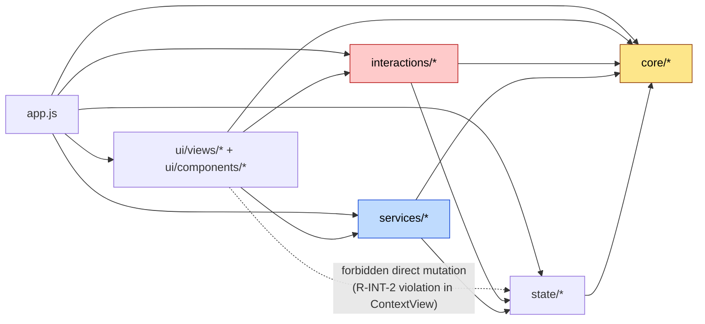
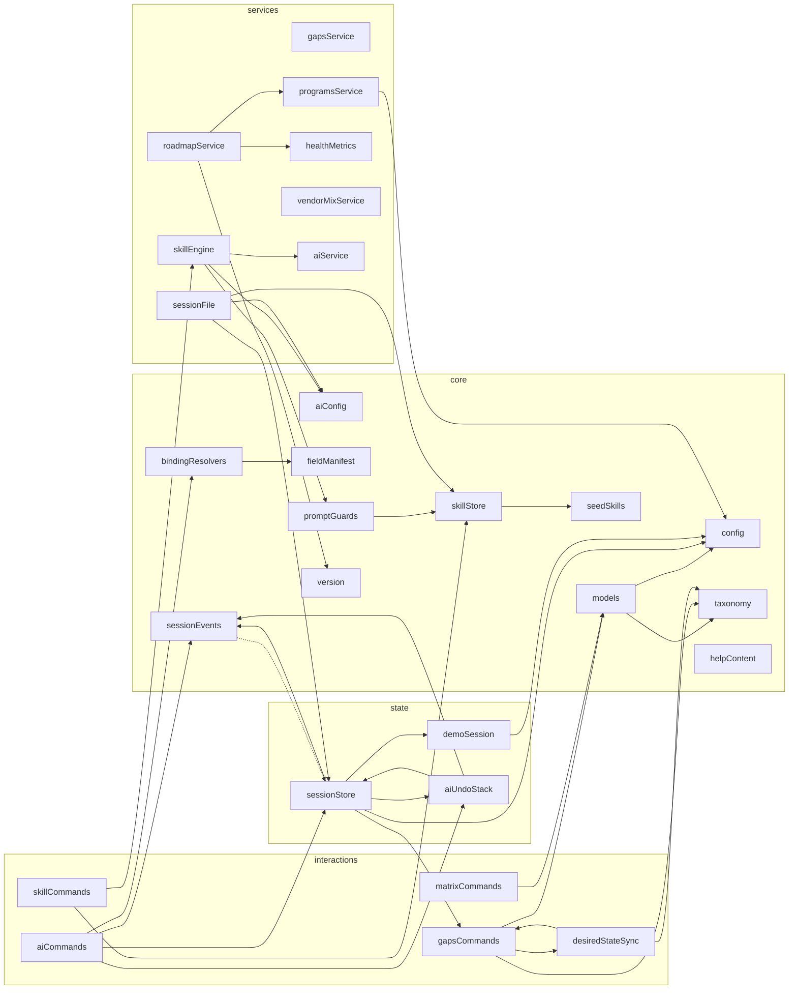

# Module dependency graph (auto-derived)

Generated for `v2.4.11.d02` from `import` statements across `app.js` + `core/` + `state/` + `services/` + `interactions/` + `ui/`. Diagnostics excluded (test code is allowed to import everything).

The graph respects the strict layering rule (SPEC §1 invariant 6): only `interactions/*` mutates session state. Services are pure reads. Views call commands and read services — never mutate directly.

---

## Layer-level graph

Direction of allowed dependencies:
- `ui → interactions, services, core` (call commands, read derivations)
- `ui → state` is the **forbidden direct path** (per SPEC §1 invariant 6). Tracked R-INT-2 violation in [`ContextView.js:130`](../../../ui/views/ContextView.js); fix queued for v2.5.x per [ADR-009](../../adr/ADR-009-relationship-cascade-policy.md).
- `interactions → state, core` (mutate, validate)
- `services → state, core` (read)
- `state → core` (validate, types)
- No layer imports a layer that's "below" it on the diagram (writers → readers, readers → state) except as commented above.

## Module-level dependencies (key edges)

## Cross-layer cycle check

The graph is **acyclic** at the layer level. There IS a circular import at the module level: `state/sessionStore.js` imports `setPrimaryLayer` + `deriveProjectId` from `interactions/gapsCommands.js`, while `interactions/gapsCommands.js` imports `validateGap` from `core/models.js` (no cycle there). The "state → interactions" edge exists for the migrator backfill paths (M6 + M7 in [docs/RULES.md](../../RULES.md)) — using helpers that live in `interactions/` to maintain the primary-layer invariant + projectId on legacy load. ES modules handle the late-binding fine.

Documented in [`state/sessionStore.js`](../../../state/sessionStore.js) line 11: `import { setPrimaryLayer, deriveProjectId } from "../interactions/gapsCommands.js";` — the comment explains it's a one-way import for migrator helpers, not a cycle.

## Dependencies on external code

**None.** `package.json` does not exist. No npm dependencies, no CDN scripts, no vendored libraries (per [ADR-001](../../adr/ADR-001-vanilla-js-no-build.md)).

The browser-side runtime depends on:
- ES modules (modern browser baseline; last 2 majors of Chromium / Firefox / Safari)
- File System Access API (Chrome / Edge for the `.canvas` save flow; graceful fallback elsewhere)
- localStorage API (universal)

Server-side container depends on:
- `nginx:1.27-alpine` (pinned major)
- `apache2-utils` (apk-installed for `htpasswd` binary)

See [docs/operations/DEPENDENCY_POLICY.md](../../operations/DEPENDENCY_POLICY.md) for bump cadence.

## Refresh trigger

Re-generate this file every `.dNN` hygiene-pass and any time a new module is added or import edges change at the layer level.
